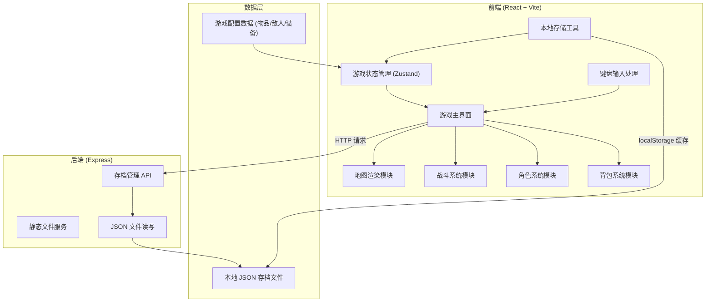
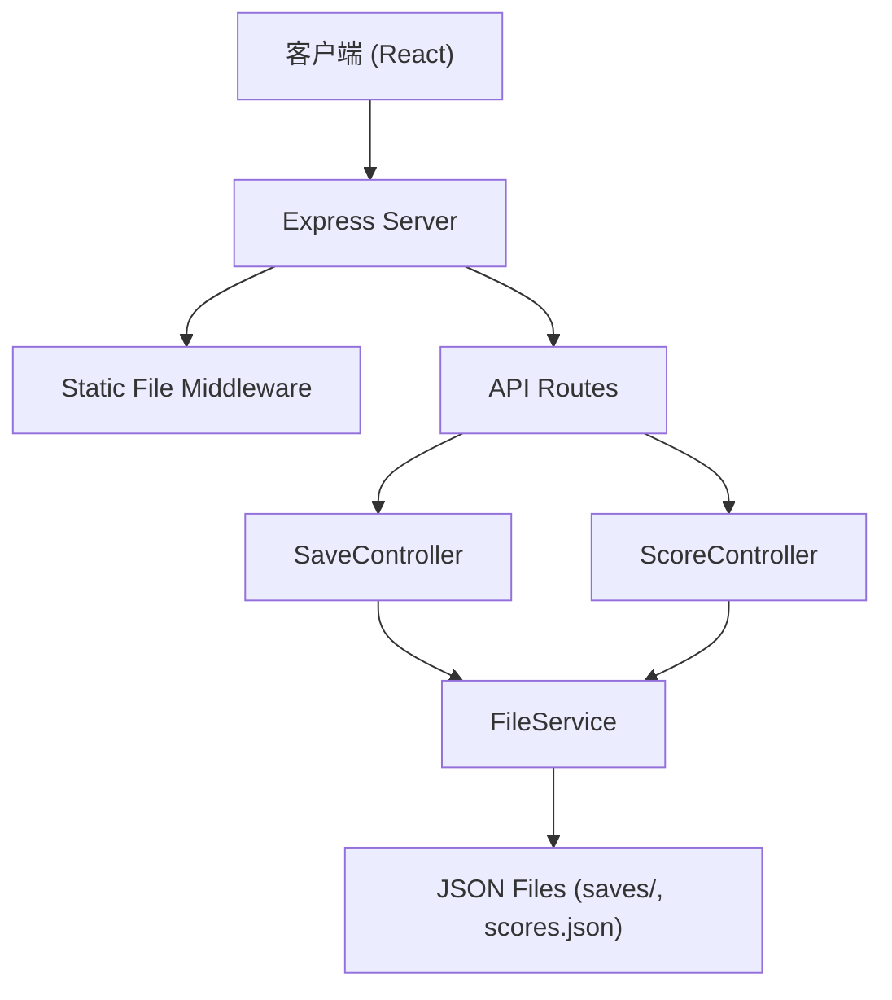
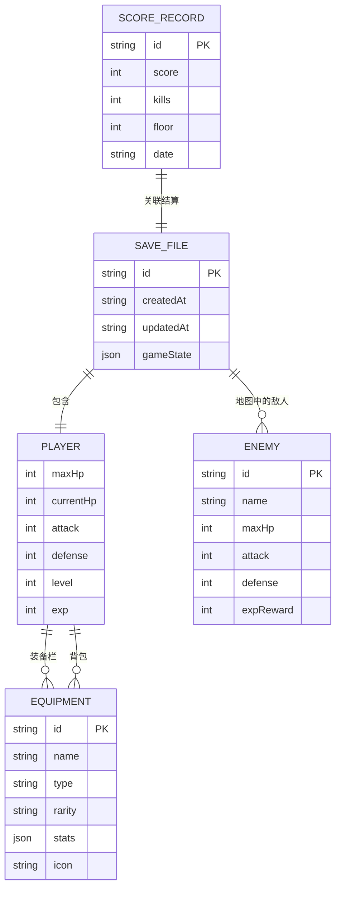

## 1. 架构设计



整体采用前后端分离架构：
- **前端**：React 单页应用，负责游戏渲染、用户交互、游戏逻辑
- **后端**：Express 服务，提供静态文件托管和存档管理 API
- **数据层**：JSON 文件持久化存储游戏进度和配置数据

## 2. 技术描述

### 2.1 前端技术栈
- **框架**：React@18 + TypeScript
- **构建工具**：Vite@5
- **状态管理**：Zustand（轻量级状态管理，适合游戏状态）
- **样式方案**：TailwindCSS@3 + 自定义 CSS 动画
- **路由**：React Router@6

### 2.2 后端技术栈
- **框架**：Express@4
- **语言**：TypeScript
- **文件操作**：Node.js fs 模块
- **CORS 处理**：cors 中间件

### 2.3 初始化工具
- 前端：`npm create vite@latest client -- --template react-ts`
- 后端：`npm init -y` + 手动配置 TypeScript + Express

### 2.4 数据存储
- 游戏存档：本地 JSON 文件 (`server/saves/`)
- 游戏配置：前端内置 JSON 数据 (`client/src/data/`)
- 浏览器缓存：localStorage 用于临时存档

## 3. 路由定义

| 路由路径 | 页面/接口 | 用途 |
|----------|-----------|------|
| `/` | 主菜单页面 | 游戏入口，新游戏/继续/排行榜 |
| `/game` | 游戏主界面 | 地牢探索、战斗、背包 |
| `/gameover` | 结算页面 | 死亡结算、积分展示 |
| `/api/save` | POST 接口 | 保存游戏进度到 JSON |
| `/api/load` | GET 接口 | 从 JSON 加载游戏进度 |
| `/api/scores` | GET 接口 | 获取历史积分排行 |

## 4. API 定义

### 4.1 类型定义

```typescript
// 位置
interface Position {
  x: number;
  y: number;
}

// 角色属性
interface PlayerStats {
  maxHp: number;
  currentHp: number;
  attack: number;
  defense: number;
  level: number;
  exp: number;
  expToNext: number;
}

// 装备
interface Equipment {
  id: string;
  name: string;
  type: 'weapon' | 'armor' | 'accessory';
  rarity: 'common' | 'uncommon' | 'rare' | 'epic' | 'legendary';
  stats: {
    attack?: number;
    defense?: number;
    maxHp?: number;
  };
  icon: string;
}

// 敌人
interface Enemy {
  id: string;
  name: string;
  maxHp: number;
  currentHp: number;
  attack: number;
  defense: number;
  expReward: number;
  icon: string;
  drops: string[]; // 装备ID列表
}

// 地图格子
interface Tile {
  type: 'wall' | 'floor' | 'stairs' | 'item' | 'enemy';
  explored: boolean;
  enemy?: Enemy;
  item?: Equipment;
}

// 地牢地图
interface DungeonMap {
  width: number;
  height: number;
  floor: number;
  tiles: Tile[][];
  playerPosition: Position;
}

// 游戏状态
interface GameState {
  player: {
    stats: PlayerStats;
    position: Position;
    equipment: {
      weapon: Equipment | null;
      armor: Equipment | null;
      accessory: Equipment | null;
    };
    inventory: Equipment[];
  };
  dungeon: DungeonMap;
  combat: {
    active: boolean;
    enemy: Enemy | null;
    playerTurn: boolean;
    log: string[];
  };
  gameLog: string[];
  score: number;
  kills: number;
}

// 存档
interface SaveFile {
  id: string;
  createdAt: string;
  updatedAt: string;
  gameState: GameState;
}

// 积分记录
interface ScoreRecord {
  id: string;
  score: number;
  kills: number;
  floor: number;
  date: string;
}
```

### 4.2 请求/响应

#### POST `/api/save`
```typescript
// Request Body
{
  gameState: GameState;
  saveId?: string;
}

// Response
{
  success: boolean;
  saveId: string;
  message: string;
}
```

#### GET `/api/load`
```typescript
// Query: ?saveId=xxx
// Response
{
  success: boolean;
  gameState?: GameState;
  message: string;
}
```

#### GET `/api/scores`
```typescript
// Response
{
  success: boolean;
  scores: ScoreRecord[];
}
```

#### POST `/api/scores`
```typescript
// Request Body
{
  score: number;
  kills: number;
  floor: number;
}

// Response
{
  success: boolean;
  record: ScoreRecord;
}
```

## 5. 服务器架构



### 目录结构
```
server/
├── src/
│   ├── controllers/
│   │   ├── saveController.ts
│   │   └── scoreController.ts
│   ├── services/
│   │   └── fileService.ts
│   ├── types/
│   │   └── index.ts
│   ├── routes/
│   │   ├── save.ts
│   │   └── score.ts
│   └── index.ts
├── saves/
├── data/
│   └── scores.json
├── package.json
└── tsconfig.json
```

## 6. 数据模型

### 6.1 ER 图



### 6.2 JSON 文件结构

#### 存档文件 (`saves/{saveId}.json`)
```json
{
  "id": "save_abc123",
  "createdAt": "2026-06-18T10:00:00Z",
  "updatedAt": "2026-06-18T10:30:00Z",
  "gameState": {
    "player": {
      "stats": {
        "maxHp": 100,
        "currentHp": 80,
        "attack": 15,
        "defense": 5,
        "level": 1,
        "exp": 0,
        "expToNext": 100
      },
      "position": { "x": 5, "y": 5 },
      "equipment": {
        "weapon": null,
        "armor": null,
        "accessory": null
      },
      "inventory": []
    },
    "dungeon": {
      "width": 50,
      "height": 50,
      "floor": 1,
      "tiles": [],
      "playerPosition": { "x": 5, "y": 5 }
    },
    "combat": {
      "active": false,
      "enemy": null,
      "playerTurn": true,
      "log": []
    },
    "gameLog": [],
    "score": 0,
    "kills": 0
  }
}
```

#### 积分记录 (`data/scores.json`)
```json
{
  "records": [
    {
      "id": "score_1",
      "score": 2500,
      "kills": 15,
      "floor": 5,
      "date": "2026-06-18T10:00:00Z"
    }
  ]
}
```

#### 游戏配置数据 (`client/src/data/equipment.json`)
```json
{
  "weapons": [
    {
      "id": "sword_1",
      "name": "铁剑",
      "type": "weapon",
      "rarity": "common",
      "stats": { "attack": 5 },
      "icon": "⚔️"
    }
  ],
  "armors": [...],
  "accessories": [...]
}
```
