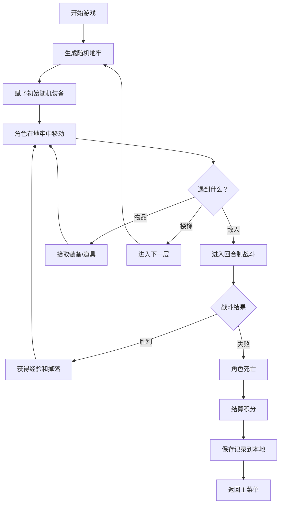

## 1. 产品概述

一款基于浏览器的 Roguelike 地牢探险小游戏，玩家控制角色在随机生成的地牢中探索、战斗、收集装备，通过回合制战斗系统击败敌人，死亡后根据探索进度和击杀数结算积分。

- **核心玩法**：随机地牢探索 + 回合制战斗 + 装备收集
- **目标用户**：休闲游戏玩家、Roguelike 爱好者
- **产品价值**：提供轻量级、高重玩度的网页游戏体验

## 2. 核心特性

### 2.1 用户角色

| 角色 | 注册方式 | 核心权限 |
|------|----------|----------|
| 玩家 | 无需注册，直接开始 | 游戏游玩、存档管理、积分查看 |

### 2.2 功能模块

1. **主菜单页面**：游戏开始、继续游戏、积分排行榜
2. **游戏主界面**：地牢地图、角色状态、背包系统、战斗系统
3. **结算页面**：死亡结算、积分统计、游戏数据展示

### 2.3 页面详情

| 页面名称 | 模块名称 | 功能描述 |
|----------|----------|----------|
| 主菜单 | 开始游戏 | 生成新的随机地牢，赋予角色初始随机装备 |
| 主菜单 | 继续游戏 | 从本地 JSON 存档恢复游戏进度 |
| 主菜单 | 积分排行 | 展示历史最高积分记录 |
| 游戏主界面 | 地牢地图 | 显示已探索区域，支持角色移动（WASD/方向键） |
| 游戏主界面 | 角色状态 | 显示生命值、攻击力、防御力、等级、经验值 |
| 游戏主界面 | 背包系统 | 查看装备、更换装备、丢弃物品 |
| 游戏主界面 | 战斗系统 | 回合制战斗界面，攻击/防御/使用物品/逃跑选项 |
| 游戏主界面 | 消息日志 | 显示战斗信息、拾取信息、事件提示 |
| 结算页面 | 死亡结算 | 显示本次游戏的积分、击杀数、探索层数、获得装备 |
| 结算页面 | 操作选项 | 返回主菜单、重新开始 |

## 3. 核心流程

玩家进入游戏后，系统随机生成地牢地图并赋予初始装备。玩家通过键盘控制角色在地牢中移动，探索过程中会遇到敌人、物品或通往下一层的楼梯。遇到敌人时进入回合制战斗，胜利后获得经验和掉落物，失败则游戏结束并结算积分。所有游戏进度（地图、角色状态、背包）实时保存到本地 JSON 文件中。

## 4. 用户界面设计

### 4.1 设计风格

- **主色调**：深紫色 (#2D1B4E) + 金色 (#FFD700) + 暗红色 (#8B0000)
- **辅助色**：暗青色 (#1A5276) + 石灰色 (#95A5A6)
- **按钮风格**：像素风边框，悬停时有发光效果，点击有按压动画
- **字体**：像素风格字体 (Press Start 2P) 用于标题，正文使用清晰易读的等宽字体
- **布局风格**：经典 Roguelike 三栏布局 - 左侧地图、中间战斗/信息区、右侧角色/背包
- **视觉元素**：使用 Emoji 和 ASCII 字符作为游戏图标，复古像素风

### 4.2 页面设计概述

| 页面名称 | 模块名称 | UI 元素 |
|----------|----------|----------|
| 主菜单 | 标题区 | 大型像素艺术 Logo，渐变发光效果，浮动动画 |
| 主菜单 | 按钮区 | 三个主要按钮（新游戏、继续、排行榜），垂直居中排列 |
| 主菜单 | 背景 | 动态星空背景，缓慢移动的粒子效果 |
| 游戏主界面 | 地图区域 | 网格地图，使用不同颜色/符号表示墙壁、地板、敌人、物品、楼梯 |
| 游戏主界面 | 角色面板 | 血条、经验条、属性数值，装备栏位 |
| 游戏主界面 | 背包区域 | 物品格子，支持拖拽/点击装备 |
| 游戏主界面 | 战斗界面 | 敌人立绘、战斗选项按钮、伤害数字浮动动画 |
| 游戏主界面 | 消息日志 | 滚动文字区域，显示最近事件，不同颜色区分消息类型 |
| 结算页面 | 统计面板 | 大号数字展示积分、击杀数、层数，动画计数效果 |
| 结算页面 | 奖章区 | 根据成绩显示不同等级的奖章 |

### 4.3 响应式设计

- **桌面优先**：1280px 以上宽度为最佳体验，三栏布局完整展示
- **平板适配**：768px-1279px，地图区域居中，角色和背包面板可折叠
- **移动端**：768px 以下，采用上下布局，地图在上，信息面板在下，支持触摸滑动移动

### 4.4 动画与交互

- **地图探索**：角色移动时有平滑过渡动画，迷雾区域探索时有渐显效果
- **战斗系统**：攻击时有屏幕震动效果，伤害数字弹出动画，血条平滑减少
- **物品拾取**：拾取时有粒子收集动画，背包格子高亮闪烁
- **升级效果**：升级时有金色光芒环绕角色，属性提升数字浮动显示
- **死亡动画**：屏幕逐渐变红，角色图标闪烁消失，结算界面淡入
